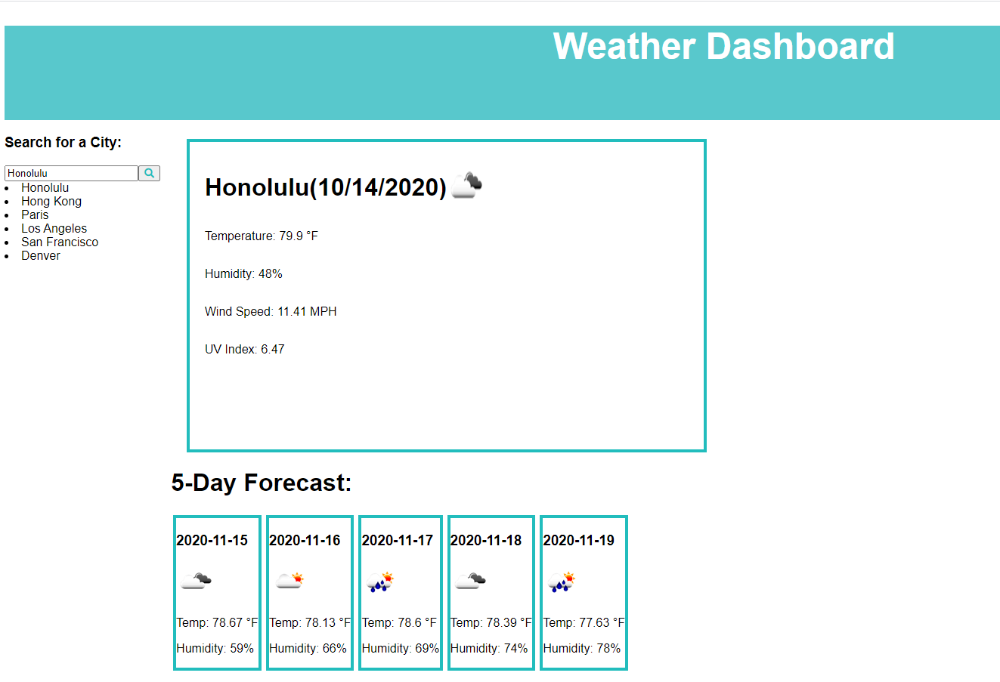

# Weather Dasboard

> AS A traveler
  I WANT to see the weather outlook for multiple cities
  SO THAT I can plan a trip accordingly

---

### Table of Contents

- [Description](#description)
- [Technologies](#technologies)
- [How To Use](#how-to-use)
- [License](#license)
- [Author Info](#author-info)

---

## Description

Simple weather app build with JavaScript, HTML, CSS and Weather API. Enter a city in the search box to render the current weather and five day forecast.

### Technologies

- JavaScript
- Weather API
- HTML
- CSS

## How to Use

Enter a city in the search, current weather and five day forecast are rendered to the page. Search history is updated each time so you can click on previous cities. 

### License

Distributed under the MIT License. See LICENSE for more information.

[Back To The Top](#weather-dashboard)

---

## Author Info

Fatim Robbins
fmsis@hotmail.com
Project link - https://melodie15.github.io/weatherdashboard/ 
